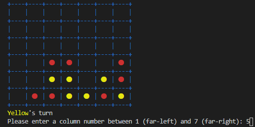
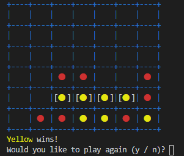

# Command Four

A command-line implementation of Connect Four written in Ruby

## Gameplay

From [Wikipedia](https://en.wikipedia.org/wiki/command_Four):

>Connect Four is a two-player connection board game in which the players first choose a color and then take turns dropping one colored disc from the top into a seven-column, six-row vertically suspended grid. The pieces fall straight down, occupying the lowest available space within the column. The objective of the game is to be the first to form a horizontal, vertical, or diagonal line of four of one's own discs." 

This command line app has players enter a column number between 1 and 7 to indicate into which column they wish to drop their disc:



The game ends when one player gets four in a row, at which point the players get the option to play again. The losing player of one round will go first in the next round:



**Warning**: For best effect, use a terminal font that supports [large black circle, U+2B24](https://www.compart.com/en/unicode/U+2B24). Otherwise, the player pieces will render as your font's "unknown character" symbol.

## Installation

Add this line to your application's Gemfile:

```ruby
gem 'command_four'
```

And then execute:

    $ bundle install

Or install it yourself as:

    $ gem install command_four

## Development

After checking out the repo, run `bin/setup` to install dependencies. Then, run `rake spec` to run the tests. 

To install this gem onto your local machine, run `bundle exec rake install`. To release a new version, update the version number in `version.rb`, and then run `bundle exec rake release`, which will create a git tag for the version, push git commits and tags, and push the `.gem` file to [rubygems.org](https://rubygems.org).